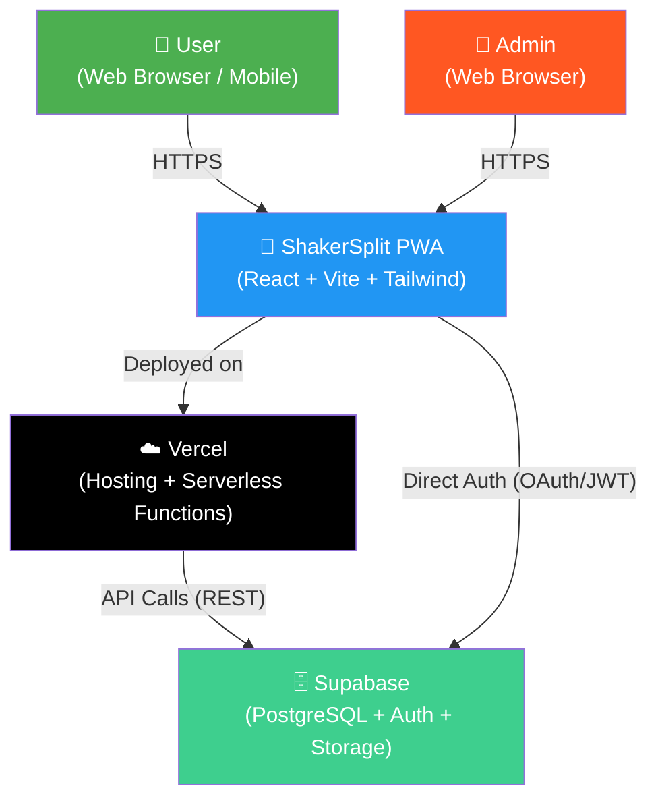
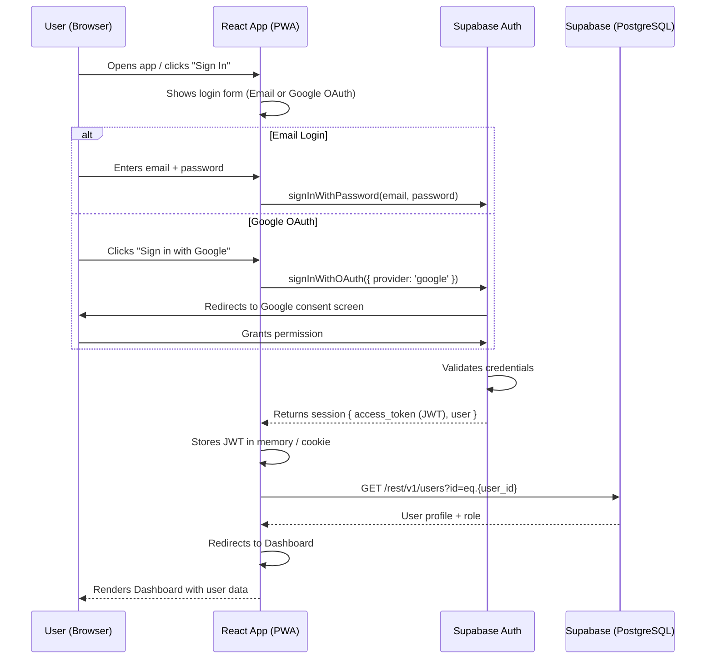
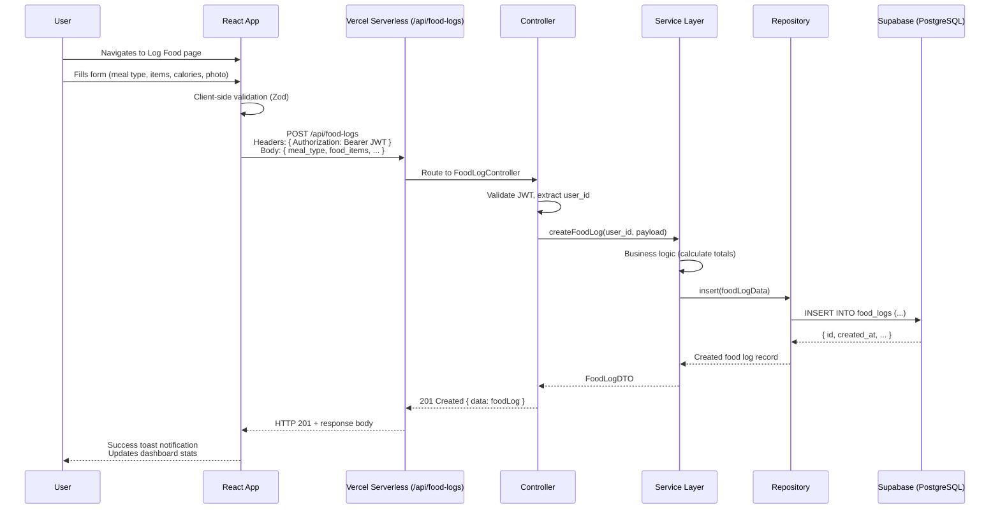
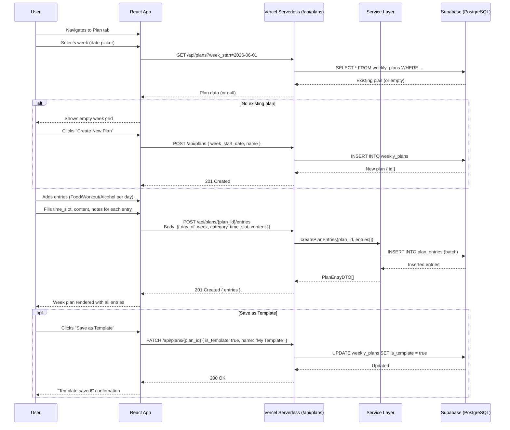
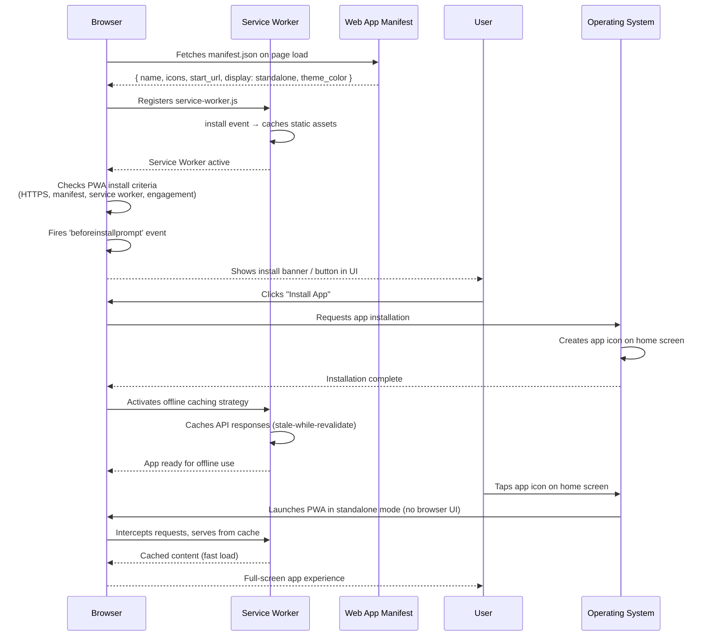
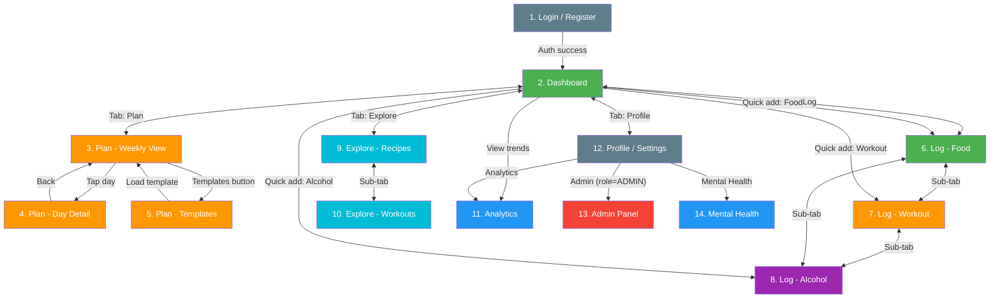
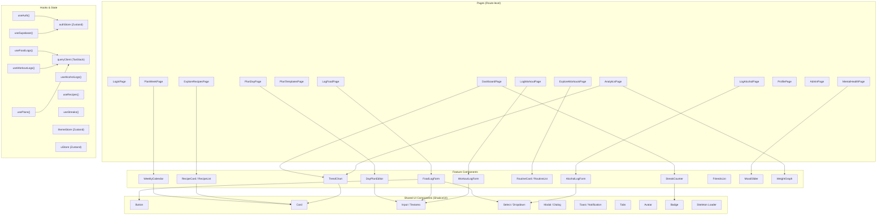
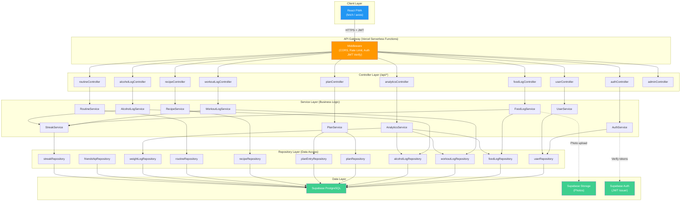

# ShakerSplit — Architecture & Design Diagrams

---

## 1. System Architecture (C4 Context Level)

---

## 2. Entity-Relationship Diagram

```mermaid
erDiagram
    USERS ||--o{ WEEKLY_PLANS : creates
    USERS ||--o{ FOOD_LOGS : logs
    USERS ||--o{ WORKOUT_LOGS : logs
    USERS ||--o{ ALCOHOL_LOGS : logs
    USERS ||--o{ MENTAL_HEALTH_LOGS : logs
    USERS ||--o{ RECIPES : creates
    USERS ||--o{ WORKOUT_ROUTINES : creates
    USERS ||--o{ WEIGHT_LOGS : tracks
    USERS ||--o{ FRIENDSHIPS : "requests (requester)"
    USERS ||--o{ FRIENDSHIPS : "receives (addressee)"
    USERS ||--|| USER_PREFERENCES : has
    USERS ||--o{ ACTIVITY_STREAKS : has
    WEEKLY_PLANS ||--o{ PLAN_ENTRIES : contains

    USERS {
        uuid id PK
        varchar email "NOT NULL UNIQUE"
        varchar display_name
        text avatar_url
        enum role "ADMIN | USER"
        decimal height_cm
        decimal weight_kg
        date date_of_birth
        timestamptz created_at
        timestamptz updated_at
    }

    WEEKLY_PLANS {
        uuid id PK
        uuid user_id FK
        date week_start_date "NOT NULL"
        varchar name
        boolean is_template "DEFAULT FALSE"
        timestamptz created_at
        timestamptz updated_at
    }

    PLAN_ENTRIES {
        uuid id PK
        uuid weekly_plan_id FK
        int day_of_week "0-6"
        enum category "FOOD | WORKOUT | ALCOHOL"
        varchar time_slot
        jsonb content
        text notes
        timestamptz created_at
    }

    FOOD_LOGS {
        uuid id PK
        uuid user_id FK
        timestamptz logged_at "NOT NULL"
        enum meal_type "BREAKFAST | LUNCH | DINNER | SNACK | PRE_GAME"
        jsonb food_items
        decimal total_calories
        decimal total_protein_g
        text photo_url
        text notes
        timestamptz created_at
    }

    WORKOUT_LOGS {
        uuid id PK
        uuid user_id FK
        timestamptz logged_at "NOT NULL"
        enum workout_type "GYM_PUSH | GYM_PULL | GYM_LEGS | RUN | WALK | OTHER"
        int duration_minutes
        jsonb exercises
        decimal calories_burned
        text notes
        timestamptz created_at
    }

    ALCOHOL_LOGS {
        uuid id PK
        uuid user_id FK
        timestamptz logged_at "NOT NULL"
        varchar spirit_type
        decimal quantity_ml "NOT NULL"
        varchar mixer
        boolean pre_game_meal_eaten
        decimal water_consumed_ml
        int intoxication_level "1-5"
        int hangover_severity "1-5"
        text notes
        timestamptz created_at
    }

    MENTAL_HEALTH_LOGS {
        uuid id PK
        uuid user_id FK
        timestamptz logged_at "NOT NULL"
        int mood_score "1-10"
        decimal sleep_hours
        int sleep_quality "1-5"
        text journal_entry
        text_array tags
        timestamptz created_at
    }

    RECIPES {
        uuid id PK
        uuid created_by FK
        varchar title "NOT NULL"
        text description
        jsonb ingredients
        text instructions
        text youtube_url
        varchar category
        decimal calories
        decimal protein_g
        int prep_time_minutes
        text photo_url
        boolean is_public "DEFAULT TRUE"
        timestamptz created_at
    }

    WORKOUT_ROUTINES {
        uuid id PK
        uuid created_by FK
        varchar title "NOT NULL"
        text description
        enum workout_type "GYM_PUSH | GYM_PULL | RUN | etc."
        jsonb exercises
        text youtube_url
        enum difficulty "BEGINNER | INTERMEDIATE | ADVANCED"
        boolean is_public "DEFAULT TRUE"
        timestamptz created_at
    }

    WEIGHT_LOGS {
        uuid id PK
        uuid user_id FK
        timestamptz logged_at "NOT NULL"
        decimal weight_kg "NOT NULL"
        decimal body_fat_pct
        text notes
        timestamptz created_at
    }

    FRIENDSHIPS {
        uuid id PK
        uuid requester_id FK
        uuid addressee_id FK
        enum status "PENDING | ACCEPTED | DECLINED"
        timestamptz created_at
    }

    USER_PREFERENCES {
        uuid id PK
        uuid user_id FK "UNIQUE"
        enum theme "DARK | LIGHT"
        boolean notifications_enabled
        varchar default_units
        varchar timezone
        timestamptz created_at
        timestamptz updated_at
    }

    ACTIVITY_STREAKS {
        uuid id PK
        uuid user_id FK
        enum streak_type "FOOD_LOG | WORKOUT | ALCOHOL_FREE | OVERALL"
        int current_count
        int longest_count
        timestamptz last_logged_at
        timestamptz created_at
        timestamptz updated_at
    }
```

---

## 3. Use Case Diagram

```mermaid
graph TB
    subgraph Actors
        USER["👤 USER"]
        ADMIN["👤 ADMIN"]
    end

    subgraph "Planning"
        P1["Create Weekly Plan"]
        P2["Edit Plan Entries"]
        P3["Save Plan as Template"]
        P4["Load Template"]
        P5["View Day Detail"]
    end

    subgraph "Logging"
        L1["Log Food Intake"]
        L2["Log Workout"]
        L3["Log Alcohol Consumption"]
        L4["Log Mental Health / Mood"]
        L5["Log Weight"]
        L6["Upload Food Photo"]
    end

    subgraph "Exploring"
        E1["Browse Recipes"]
        E2["Browse Workout Routines"]
        E3["Watch YouTube Links"]
        E4["Save Recipe to Favorites"]
    end

    subgraph "Analytics"
        AN1["View Dashboard Summary"]
        AN2["View Trends & Charts"]
        AN3["View Activity Streaks"]
        AN4["Track Weight Over Time"]
    end

    subgraph "Social"
        S1["Send Friend Request"]
        S2["Accept/Decline Request"]
        S3["View Friend Activity"]
    end

    subgraph "Admin Panel"
        AD1["Manage Users (CRUD)"]
        AD2["Moderate Recipes & Routines"]
        AD3["View All Users Analytics"]
        AD4["Send Push Notifications"]
        AD5["Configure Global Settings"]
    end

    USER --> P1
    USER --> P2
    USER --> P3
    USER --> P4
    USER --> P5
    USER --> L1
    USER --> L2
    USER --> L3
    USER --> L4
    USER --> L5
    USER --> L6
    USER --> E1
    USER --> E2
    USER --> E3
    USER --> E4
    USER --> AN1
    USER --> AN2
    USER --> AN3
    USER --> AN4
    USER --> S1
    USER --> S2
    USER --> S3

    ADMIN --> AD1
    ADMIN --> AD2
    ADMIN --> AD3
    ADMIN --> AD4
    ADMIN --> AD5
    ADMIN -.->|"inherits"| USER
```

---

## 4. Sequence Diagrams

### 4a. Login Flow

### 4b. Log Food

### 4c. Create Weekly Plan

### 4d. PWA Install Flow

---

## 5. Navigation Flow (14 Pages)

---

## 6. Frontend Component Architecture

---

## 7. Backend API Layer (MVC + Service + Repository)

---

## Summary

| #   | Diagram                | Type            | Purpose                                 |
| --- | ---------------------- | --------------- | --------------------------------------- |
| 1   | System Architecture    | C4 Context      | High-level system boundaries            |
| 2   | E-R Diagram            | erDiagram       | Full database schema with all 13 tables |
| 3   | Use Case Diagram       | graph TB        | All actor-action mappings               |
| 4a  | Login Flow             | sequenceDiagram | Auth sequence with OAuth                |
| 4b  | Log Food               | sequenceDiagram | Full MVC request lifecycle              |
| 4c  | Create Weekly Plan     | sequenceDiagram | Plan creation with template save        |
| 4d  | PWA Install            | sequenceDiagram | Service worker + install prompt         |
| 5   | Navigation Flow        | flowchart TD    | 14-page routing map                     |
| 6   | Component Architecture | graph TD        | Frontend layers + hooks + stores        |
| 7   | Backend API Layer      | graph TD        | MVC + Service + Repository pattern      |
